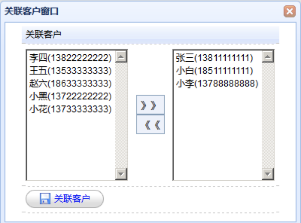

# 关联客户左右选择框页面调整



## 第一步：修改定区页面中关联客户按钮绑定事件处理函数

```text
function doAssociations(){
		//获取当前数据表格所有选中的行，返回数组
		var rows = $("#grid").datagrid("getSelections");
		if(rows.length != 1){
			//弹出提示
			$.messager.alert("提示信息","请选择一个定区操作！","warning");
		}else{
			//选中了一个定区
			$('#customerWindow').window('open');
			//清理下拉框
			$("#noassociationSelect").empty();
			$("#associationSelect").empty();
			//发送ajax请求，请求定区Action，在定区Action中通过crm代理对象完成对于crm服务远程调用获取客户数据
			var url_1 = "decidedzoneAction_findListNotAssociation.action";
			$.post(url_1,function(data){
				//遍历json数组
				for(var i=0;i<data.length;i++){
					var id = data[i].id;
					var name = data[i].name;
					var telephone = data[i].telephone;
					name = name + "(" + telephone + ")";
					$("#noassociationSelect").append("<option value='"+id+"'>"+name+"</option>");
				}
			});
			
			//发送ajax请求，请求定区Action，在定区Action中通过crm代理对象完成对于crm服务远程调用获取客户数据
			var url_2 = "decidedzoneAction_findListHasAssociation.action";
			var decidedzoneId = rows[0].id;
			$.post(url_2,{"id":decidedzoneId},function(data){
				//遍历json数组
				for(var i=0;i<data.length;i++){
					var id = data[i].id;
					var name = data[i].name;
					var telephone = data[i].telephone;
					name = name + "(" + telephone + ")";
					$("#associationSelect").append("<option value='"+id+"'>"+name+"</option>");
				}
			});
		}
	}

```

## 第二步：在定区Action中注入crm代理对象，并且提供方法远程调用crm服务


## 第三步：为关联客户窗口中左右移动两个按钮绑定事件


## 第四步：为定区关联客户窗口中的“关联客户”按钮绑定事件


